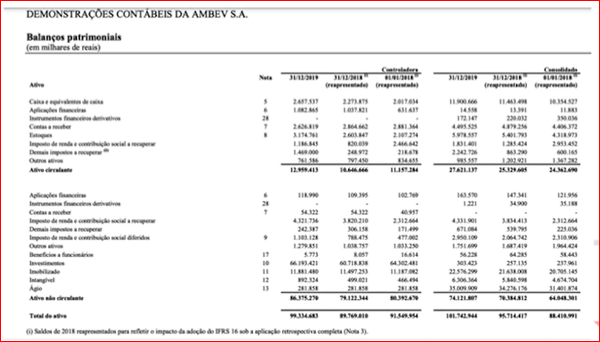

# Introdução a Contabilidade:

 

----
----
----

 

* Demonstrações Contábeis da Ambev S.A.

 

----

 

 

----

 

>[!NOTE]
> Como esse documento é composto? 
> Vamos aprender a seguir

 

----

 

- Introdução
- Demonstrações Financeiras
- Balanço Patrimonial
- Apuração de Resultado (DRE)
- Indicadores de Desempenho
- Fluxo de Caixa
- Rentabilidade
- Liquidez
- Outros Indicadores

 

----
----
----

 

# O que é a contabilidade

 

----

 

>[!NOTE]
> A contabilidade fala ao longo do tempo, um sistema de coleta e processamenro de dados.

 

----

 

 

----

 

### Coleta de Dados

 

----

 

>[!NOTE]
> Reconhecimento: Como e quando eu contabilizo?
> - Como:  conceitos contábeis e princípios básicos de contabilidade
> - Quando: Probabilidade de que eu obtenha ganhos com o evento e eu posso mensurar com base sólida seu verdadeiro valor.

 

----
----

 

### Mensuração e Registro

 

----

 

> [!NOTE] 
> Mensuração e Registro
> - Mensuração: Por quanto contabilizar?
> - Custo Histórico x Valor Justo
> - Relatórios: Como divulgar?
> - Registro contábil e Notas Explicativas

 

----
----

 

### Relatório

 

----

 

>[!NOTE]
> 
> Usuários da informação contábil
>
>   Internos (que estão dentro da empresa)
>   - Administradores (Gerentes)
>
>   Externos (que estão fora)
>   - Acionistas, Analistas, Credores (Bancos), Governo (Fisico), Fornecedores, Clientes

 

----
----

 

## Tipos de contabilidade

 

----

 

>[!NOTE]
>
> Duas Grandes ênfases:
>
> - Contabilidade Gerencial: voltada para os usuários internos
>
> - Contabilidade Financeira: voltada para a produção dos relatórios contábeis fornecidos aos usuários externos

 

----
----
----

 

# Como a empresa gera valor? 

 

----

 

> [!NOTE]
>
> <b>Lucro</b>
>
> O que é lucro?
>
> - Todo ganho ou vantagem obtida em uma transação.
>
> Todo lucro é igual? Não!
>
> - Lucro econômico x Lucro contábil
>
>Lucro contábil é a diferença simples entre os retornos e os custos das transações realizadas pela entidade.

>>>>> Acabei aqui

 

----
----
----

 

* DRE: Apuração de resultado.

Balanço Patrimonial (BP)
Demonstração de Resultado (DRE)
Demonstração do Fluxo de Caixa (DFC)

*
Contabilidade
Coleta de Dados > Registro > Relatórios > Usuários

*
Custo Histórico x Valor Justo

*
A função da empresa é só gerar lucro?
Ou se espera geração de RESULTADO?

Organizações, coperativas.. etc..

* 
Shareholders: Detentores de ações (share)

Distribuição de dividendos.

*
Stakeholders
Clientes, fornecedores, funcionários, comunidade local, etc..

*
A empresa não deve gerar só lucro e sim cultivar relações com os stkeholders 

Qual a sua escolha como investidor?
Geração de valor. (Stakeholders)
Geração de lucro.
Valor e lucro

*
Normas Contábeis. (8000 A,C)

IASC ==> Em 1973 - Normas Internacionais de Contabilidade
IASB e IFRS ==> Em 2001 - Substitui o IASC
CPC ==> 2005

- Conselho Federal de Contabilidade (CFC) ==> Edita as normas brasileiras de contabilidade (NBCs)

- Comitê de Pronunciamentos Contábeis (CPC)

- Comissão de Valores Mobiliário (CVM)

CPC ==> Centralizados das normas contábeis - Intepreta as normas internacionais para o Brasil.

- SUSEP, SRF, CVM, BACEN (Orgãos oficiais do Governo Brasileiro)
- Abrasca, Apimec Nacional, B3, CFC, FIPECAFI IBRACON

CVM ==> Criada em 07/12/1976 pela lei 6.385/76
Objetivo: Fiscalizar, normatizar, disciplinar e desenvolver o mercado de valores mobiliários no Brasil.
Instância máxima do mercado de capitis brasileiro.

*
Normas Contábeis no Mundo

- EUA - Financial Accounting Standards Board (FASB): USGAAP

- Mundo - International Accounting Standards Board (IASB): padrão a ser seguido.

*
Regime de caixa e Regime de Competência.
Regime Caixa - Entrada e Saída
Regime de Competência -  A despesa e a receita nem sempre ocorrem quando ocorre uma venda ou compra.. 
exemplos financiamentos, calotes entre outros.

Conceito de Receita e Despesa
- Receita são entradas de recurso ou aumento de ativos.
- Despesas são saídas de recurso ou redução de ativos.

*
Demonstrações Contábeis

Conjunto de Demonstrações Contábeis.
++Obrigatórias
- Balanço Patrimonial (BP)
- Demonstração dos Resultados do Exercício (DRE)
- Demonstração dos Fluxos de Caixa (DFC)
- Demonstração das Mutações do Patrimônio Líquido (DMPL)
++Obrigatórias no Brasil
- Demonstração do Valor Adicionado (DVA)
++Não Obrigatórias
- Parecer dos Auditores Independentes
- Relatórios de Sustentabilidade

-- Balanço Patrimonial (BP) ==> É a representação quantitativa do PATRIMÔNIO de uma entidade
É composto por 3 elementos: 
- Ativo - Bens e Direitos da Organização
- Passivo - Dividas 
- Patrimônio Líquido - O que gera de recurso para o acionista, agregação de valor. 

-- Demonstração dos Resultados do Exercício (DRE)
Apresenta de forma resumida o resultado apurado num determinado período.
Alguns elementos básicos da DRE:
1 - A receita liquida das vendas e serviços, as deduções das vendas, os abatimentos e os impostos.
2 - As despesas com as vendas, financeiras, gerais e administrativas, e outras despesas operacionais.
3 - O lucro ou prejuízo operacional, as outras receitas e as outras despesas.
4 - O resultado do exercício antes do Imposto sobre a Renda.
5 - O lucro ou prejuízo líquido do exercício.

- Demonstração dos Fluxos de Caixa (DFC)
Se trata de um controle de entradas e saídas de dinheiro no período.
Tem o objetivo de melhorar o controle de fluxo de caixa,

É dividida em três partes:
-Atividades Operacionais
-Atividades de Investimento
-Atividades de Financiamento (passivo circulante e não cirlulante) financiamentos e emprestimos, novos sócios, dividendos.

-- Demonstração das Mutações do Patrimônio Líquido (DMPL)`
É o control da formação do patrimônio líquido da empresa.

A DMPL mostra:
-As retenções de lucros
-As distribuições de lucos aos sócios
-Os ajustes de exercícios anteriores
-Saldos aindannão destinados etc.

-- Demonstração do Valor Adicionado (DVA) ==> evidencia os valores correspondentes à formação da riqueza gerada pela empresa
1 - como índice de avaliação de geração d valor
2 - como índice de avaliação do desempenho social.

-- Outros Relatórios 
Parecer dos Auditores Independentes - Toda empresa listada na bolsa passa por auditoria externa**
Parecer favorável ou não.

relatório da administração: Relatório de sustentabilidade - tem ficado cada vez mais importante

*
Obtendo e analisando uma demonstração contábil.

Site de RI das empresas - Informações aos investidores - informações relevantes.

IAN - Informações Anuais
ITR - Informações Trimestrais
DFP - Demonstração Anual

